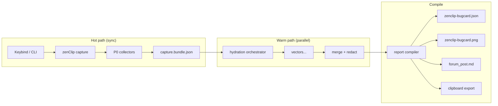
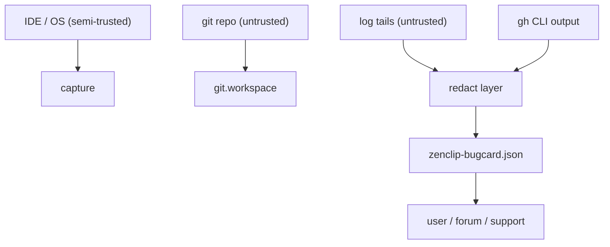

# zenClip — Architecture scaffold

**Companion:** [WHITEPAPER.md](WHITEPAPER.md) · **Work plan:** [tasks.md](tasks.md)

This document defines **components**, **hydration vectors**, **data flow**, and the **repository layout** to implement. Code does not exist yet; paths below are the target scaffold.

---

## 1. System context



---

## 2. Components

| Component | Responsibility | Runtime |
|-----------|----------------|---------|
| **zenclip-capture** | P0 collection, write `capture.bundle` | IDE extension host or CLI |
| **zenclip-hydrate** | Run vectors with timeouts; append to bundle | Same process or child workers |
| **zenclip-compile** | Canonicalize, `report_id`, emit card + exports | CLI (bash/node — TBD in tasks) |
| **zenclip-render** | Card → PNG layout | Headless renderer (HTML→PNG or Cairo) |
| **zenclip-store** | Idempotent filesystem store under `~/.zenclip/reports/<report_id>/` | CLI |

### 2.1 Interface contract

All components communicate via **files** or **stdin JSON** — no shared mutable state (GW-AAP Open Piping).

```text
zenclip capture  --out /tmp/capture.bundle.json
zenclip hydrate  --in capture.bundle.json --out capture.hydrated.json
zenclip compile  --in capture.hydrated.json --out-dir ~/.zenclip/reports/
```

`zenclip snap` = capture + hydrate (P1 only) + compile (single user command).

---

## 3. Hydration vectors

Each vector implements:

```text
run(ctx) -> { ok, latency_ms, records[], artifacts[], error? }
```

Global orchestrator: `max_parallel=6`, default vector timeout `2000ms`, P0 vectors not used here.

| Vector ID | Tier | Description | Depends on |
|-----------|------|-------------|------------|
| `host.os` | P0 | OS, arch, display scale | — |
| `cursor.build` | P0 | IDE version, commit, embedded VS Code version | Cursor API or `cursor --version` |
| `cursor.ui_focus` | P0 | Active editor, webview title | Extension API |
| `cursor.commands_recent` | P0 | Last N command executions | Extension API |
| `git.workspace` | P0 | root, branch, sha, dirty count | `git` |
| `media.screen_primary` | P0 | Downscaled PNG path | OS capture API |
| `cursor.request_id` | P1 | Chat Request ID if focused | Command / API |
| `cursor.agent_bc_id` | P1 | Cloud agent bc- id if applicable | Context |
| `logs.console` | P1 | DevTools error tail | Extension |
| `logs.github_channels` | P1 | Filtered Output panel tails | Extension |
| `github.auth` | P1 | Host, authenticated Y/N | `gh auth status` sanitized |
| `github.entity` | P1 | PR/issue from UI context | Extension + parse |
| `github.labels_api` | P1 | Labels list/apply probe via `gh` | `gh`, entity |
| `env.doctor_snapshot` | P1 | `env-doctor/1` JSON in repo | `env-doctor.sh` |
| `media.screen_crop` | P2 | Crop around last click | coords |

### 3.1 Bug-class plugins

Vectors can be grouped by `bug_class` preset:

| `bug_class` | Auto-enables |
|-------------|--------------|
| `github.labels_ui` | `github.*`, `logs.github_channels`, label matrix in compile |
| `generic.ui` | P0 + `logs.console` |
| `agent.failure` | `cursor.request_id`, `cursor.agent_bc_id`, privacy flags |

Preset selection: heuristic from `cursor.ui_focus` + user override flag `--class`.

---

## 4. Data artifacts

### 4.1 capture.bundle.json (transient)

Mutable working file; **not** idempotent; may contain pre-redaction data locally only.

### 4.2 zenclip-bugcard/1 (durable)

See [schemas/zenclip-bugcard-1.schema.json](schemas/zenclip-bugcard-1.schema.json).

Key fields:

- `report_id`, `identity_fingerprint`, `revision`
- `triage`, `repro`, `hydration`, `cursor_escalation`
- `artifacts[]` with `sha256`, `role`, `path`
- `exports` paths
- `redaction.rules_applied`

### 4.3 Directory layout per report

```text
~/.zenclip/reports/<report_id>/
  zenclip-bugcard.json      # authoritative
  zenclip-bugcard.png       # rendered
  exports/
    forum_post.md
    email_subject.txt
  artifacts/
    screen_primary.png
    logs_console_tail.txt
  capture.bundle.json       # optional archive
```

---

## 5. Repository scaffold (target)

Initial landing in **env-doctor monorepo** (or split later):

```text
agents_ram/zenclip-bug-forensics/   # blueprints (this tree)
zenclip/
  README.md
  bin/zenclip                       # entry CLI
  lib/
    capture.sh                      # P0 bash collectors (git, os)
    vectors/                        # one file per vector
    redact.sh                       # shared with env-doctor patterns
    compile.sh                      # idempotent card build
    canonicalize.jq                 # identity_core JSON
  render/
    template.html                   # infograph layout
    render.mjs                      # playwright/puppeteer snapshot
  schemas/
    zenclip-bugcard-1.schema.json   # copy or symlink from agents_ram
  templates/
    forum_cursor.md.tmpl
tests/
  zenclip/
    compile-idempotency.sh
    redact-secrets.sh
    vector-github-auth.sh
```

**Decision (tasks Phase 0):** implement core in **bash + jq** for parity with env-doctor, or **Node** for extension sharing — see tasks.md ADR-001.

---

## 6. Trust boundaries



Rules:

1. Never `eval` log or config content.
2. Redact before writing card and before computing `report_id`.
3. Vectors that execute binaries use fixed argv arrays (env-doctor pattern).
4. PNG embed chunk must be redacted subset only.

---

## 7. IDE integration (phase 4)

| Piece | Mechanism |
|-------|-----------|
| Command | `zenClip.captureBugReport` |
| Keybind | User-defined; suggest chord not conflicting with GitHub label shortcuts |
| Clipboard | `text/plain` + `text/markdown` + custom MIME for JSON path |
| Toast | `report_id` + “Copied forum draft” |

Extension lives in separate repo long-term; v0 can be CLI-only.

---

## 8. Integration with env-doctor

| Integration | When |
|-------------|------|
| Vector `env.doctor_snapshot` | P1, repo contains `env-doctor.sh` |
| Shared `_redact_git_url` logic | Extract to `zenclip/lib/redact.sh` sourced from env-doctor or shared snippet |
| CI | Optional job: `zenclip compile` on fixture bundles |

---

## 9. Open decisions (ADR log)

| ID | Question | Default in tasks |
|----|----------|------------------|
| ADR-001 | Bash+jq vs Node for compile | Bash+jq MVP |
| ADR-002 | PNG renderer | Playwright HTML template (reuse test infra) |
| ADR-003 | PNG embed chunk | Phase 3 optional |
| ADR-004 | Extension vs CLI-only v0 | CLI-first |

---

## Revision history

| Version | Date | Notes |
|---------|------|-------|
| 0.1.0 | 2026-10-08 | Initial architecture scaffold |
