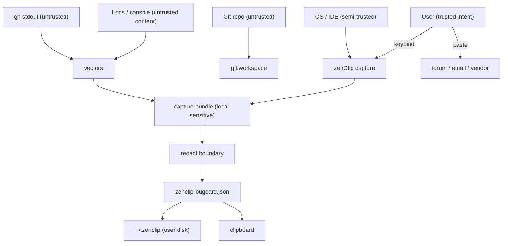

# zenClip — Trust touchpoint audit

**Audience:** Maintainers (k-dot-greyz trust review), implementers  
**Scope:** Blueprint in `agents_ram/zenclip-bug-forensics` (PR #41); **no runtime code yet**  
**Status:** 2026-10-09 — audit of design; implementation must satisfy §5 gates  
**Companion:** [WHITEPAPER.md](WHITEPAPER.md) §8 · [ARCHITECTURE.md](ARCHITECTURE.md) §6 · env-doctor [THREAT_MODEL.md](../../docs/THREAT_MODEL.md)

---

## 1. Executive verdict (for upstream review)

| Area | Blueprint posture | Merge blocker? |
|------|-------------------|----------------|
| **Egress** | Local-only v0; no auto-upload | OK for docs PR |
| **Consent** | Mentioned for screenshots only | **Gap** — add explicit capture consent (§4.1) |
| **Redaction** | Required before card + `report_id` | OK; must share env-doctor rules at implement |
| **Clipboard / forum** | User-initiated paste | OK; document as trust egress |
| **Request ID / bc-id** | Collected in P1 | OK with Cursor privacy docs cited |
| **`env.doctor_snapshot`** | Optional P1 vector | **Gap** — scope + opt-in (§4.6) |
| **Transient bundle** | May hold secrets pre-redact | **Gap** — lifecycle + permissions (§4.2) |
| **PNG / QR** | Local path in footer WIP | **Gap** — no raw home path in PNG (§4.5) |

**Recommendation:** Approve PR #41 as **design-only** with this audit attached. Block **Phase 3 ship** (user-facing `snap`) until §5 implementation gates pass.

---

## 2. Trust model (who is trusted for what)

**Principle:** zenClip is **not** a telemetry product. It is a **user-controlled export** tool. Trust fails if (a) data leaves the machine without a deliberate user action, or (b) exports contain secrets the user did not expect in a bug report.

---

## 3. Touchpoint register

Each row is a **trust touchpoint**: a moment the user or an operator should understand what happens to data.

| ID | Touchpoint | Trigger | Data classes | Storage / egress | Consent model | Mitigation (design) | Residual risk |
|----|------------|---------|--------------|------------------|---------------|---------------------|---------------|
| T1 | **Capture invoke** | Keybind / `zenclip snap` | UI focus, commands, git meta | Local bundle | **Explicit** — first-run + per-snap confirm for screen | `--no-screen`; minimal modal | User skips consent UI in implementation |
| T2 | **Screenshot P0** | Default capture | Pixels (code, tokens, PII on screen) | `artifacts/screen_primary.png` | Opt-out flag; first-use warning | Downscale; future blur | Screenshot exfil via forum attach |
| T3 | **Transient bundle** | Pre-compile | Pre-redaction logs, paths | `/tmp` or store dir | User ran snap | `chmod 700` store; delete bundle after compile; never upload | Forensics on disk theft |
| T4 | **Redaction boundary** | `compile` | All vector output | N/A (transform) | Automatic | env-doctor URL rules + `secrets_detected` counter | Novel secret formats |
| T5 | **Clipboard** | Post-compile | forum md + paths | **Other apps** | User triggered snap | Plaintext warning in toast | Any app reading clipboard |
| T6 | **Forum / email paste** | User | Full card projection | **Public / vendor** | Wholly user | Preview path; redaction block in md footer | User pastes before reading |
| T7 | **Request ID** | P1 vector | Cursor correlation id | Card + PNG | Implicit if chat focused | `privacy_mode` field; link to Cursor privacy docs | Vendor correlates session |
| T8 | **bc-id** | P1 agent | Agent run id | Card | Implicit if agent context | Same as T7 | Public forum exposes bc-id |
| T9 | **Console / log tails** | P1 | Error strings (may embed secrets) | Card or overflow blob | User ran snap | Error-only filter; length cap; redact pass | Log line contains API key |
| T10 | **`gh` vectors** | P1 | Host, login, labels JSON | Card records | User has gh auth | Sanitize `gh auth status`; no token flags | Malicious `gh` in PATH |
| T11 | **`env.doctor_snapshot`** | P1 optional | Submodule URLs, MCP hints, `.env` presence | Nested JSON in card | **Should be opt-in** | `--no-env-doctor`; redact URLs in embed | Org-private repo names on forum |
| T12 | **PNG infograph** | Phase 4 | Summary + thumbnail | File + forum attach | User | No embedded secrets in chunk; no home in QR | OCR of screenshot thumb |
| T13 | **PNG embed chunk** | ADR-003 optional | Subset JSON | Inside PNG | User shares PNG | Redacted subset only; size cap | Double source of truth drift |
| T14 | **Idempotent store** | Repeat keybind | Merged revisions | `~/.zenclip/reports/` | User | Same redaction rules per revision | Old revisions retain pre-fix leaks |
| T15 | **Network** | v0 design | — | **None by zenClip** | N/A | Document "no phone home" | Future phases must re-audit |

---

## 4. Gaps found in blueprint (rework)

### 4.1 Capture consent (T1, T2)

**Issue:** WHITEPAPER §8 warns about screenshots but does not require a **consent step** before first `snap` or before writing clipboard.

**Rework:**

- Add **first-run** `~/.zenclip/consent.json` with versioned policy text.
- Default `zenclip snap` toast: *"Copied forum draft. Screenshot saved locally — review before posting."*
- Document in Phase 0 tasks: `0.6` consent file + `--yes-i-reviewed` for CI.

### 4.2 Transient bundle lifecycle (T3)

**Issue:** ARCHITECTURE §4.1 allows pre-redaction data in `capture.bundle.json`; optional archive in report dir contradicts minimization.

**Rework:**

- **Default:** delete transient bundle after successful compile.
- **Opt-in:** `--keep-bundle` for debugging.
- Store root `~/.zenclip` mode `0700`; umask documented in `zenclip/README.md`.

### 4.3 `identity_core` and pseudonymity (T14)

**Issue:** Hashing stable fields can **link** repeated reports to the same repo/issue across time (intended for idempotency, not always desired on public forum).

**Rework:**

- Add optional `--anonymous` that salts `identity_core` with random session salt (new `report_id`, no merge).
- Document in WHITEPAPER §5.1 footnote.

### 4.4 Clipboard egress (T5)

**Rework:** Phase 3 task — clipboard contains **only** forum markdown by default; JSON path in toast, not on clipboard (avoid accidental paste of machine paths into forum).

### 4.5 PNG footer / QR (T12)

**Rework:** QR encodes `report_id` or `zenclip://report/<id>` — **not** absolute filesystem paths. Human footer: `report_id` only.

### 4.6 `env.doctor_snapshot` (T11)

**Issue:** env-doctor can emit submodule URLs and credential *warnings*; embedding full JSON in a bug card multiplies leak surface on public forum.

**Rework:**

- Default **off**; enable with `--with-env-doctor`.
- Compiler **projects** env-doctor to allowlist: `ok`, `issues`, `warnings` counts + fail keys only — not full `results` unless `--verbose-env-doctor`.

---

## 5. Implementation gates (do not ship `snap` without)

| Gate | Test / artifact |
|------|-----------------|
| G1 Redaction | `tests/zenclip/redact-secrets.sh` hostile fixtures |
| G2 No network | `zenclip snap` strace/docs — zero outbound (manual checklist) |
| G3 Bundle cleanup | Default no `capture.bundle.json` in report dir |
| G4 Consent | First-run file or `--no-screen` default for headless CI |
| G5 env-doctor projection | Snapshot vector off by default; projection unit test |
| G6 Clipboard policy | Only forum md on clipboard (integration test) |

---

## 6. Alignment with env-doctor threat model

| env-doctor vector | zenClip relevance |
|-------------------|-------------------|
| Untrusted repo / git output | `git.workspace`, labels via `gh` |
| Secret leakage in JSON | Shared `redact.sh` / `_redact_git_url` |
| Command injection | All vectors: argv arrays, no `eval` |
| JSON envelope breakage | Reuse `_escape_json_string` or jq `@json` |
| Unauthorized mutation | zenClip v0: **no** `--init` equivalent; no package installs |

zenClip **inherits** env-doctor read-only risk when `env.doctor_snapshot` is enabled; treat as **nested untrusted pipeline**.

---

## 7. Cursor vendor handoff (forum / support)

When user pastes exports:

| Field | Vendor visibility | User guidance (template footer) |
|-------|-------------------|----------------------------------|
| `request_id` | Cursor backend lookup | Mention Privacy Mode; offer Share Data repro |
| `agent_bc_id` | Cloud agent run | Public forum = consider redacting |
| Screenshot | Public | "Review for secrets" |
| Repo name / PR # | Public | User may anonymize in `repro.steps` |

Add to `forum_cursor.md.tmpl` (Phase 1.7): short **"Before you post"** block.

---

## 8. tasks.md delta (tracked)

Add to Phase 0 / 1 / 3 (see commit on branch):

- 0.6 Consent + store permissions  
- 1.10 env-doctor projection allowlist when vector enabled  
- 3.7 Clipboard policy (forum md only)  
- 3.8 Default bundle deletion; `--keep-bundle`  

---

## Revision history

| Version | Date | Author | Notes |
|---------|------|--------|-------|
| 0.1.0 | 2026-10-09 | agents_ram | Initial trust touchpoint audit for PR #41 |
