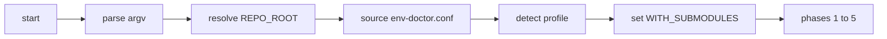

# env-doctor architecture

## Entry and bootstrap

1. **Argv** — Combined short flags (`-it2`) expanded; long options parsed.
2. **`_bootstrap_env`**
   - **`_resolve_repo_root`**: `git -C <script_dir> rev-parse --show-toplevel`, then `git rev-parse` from cwd, then legacy `../..` from script dir, then `pwd`.
   - **Source** `$REPO_ROOT/.env-doctor.conf` if present (optional).
   - **`DOCTOR_NAME`**: basename of the script path.
   - **`_detect_profile`**: `dev-master` if `.gitmodules` exists, `dex/` exists, and `.gitmodules` contains `dex/09-repos`; else `generic`. Overridable with `--profile`.
   - **`WITH_SUBMODULES`**: `true` if `--with-submodules`; `false` if `--skip-submodules`; else `true` when profile is `dev-master`, else `false`.

## Phases

| Phase | Role |
|-------|------|
| **1** | OS, shell, shell config presence, alias-shadow heuristics |
| **2** | `git`; project-type detection (`pyproject.toml`, `package.json`, `Cargo.toml`, `go.mod`); conditional Python / Node / Rust / Go checks; shared dev tools (`rg`, `shellcheck`, `yamllint`); `zen` teaser (`_info` when missing); Python venv + optional `ENV_DOCTOR_PYTHON_DEPS` imports |
| **3** | Branch, remote, dirty tree; if `WITH_SUBMODULES`: submodule status loop (tier buckets, private URL list + SSH grep); orphan gitlink check vs `.gitmodules` |
| **4** | `.env` vs `env.example`, `gh auth`, Docker daemon, Cursor MCP placeholder scan |
| **4b** | LM Studio API, `lms` CLI, repo `.cursor/mcp.json`; Agent RAM path only when `PROFILE=dev-master` or `ENV_DOCTOR_SHOW_AGENT_RAM=true` |
| **5** | `--init` only: venv + install; Tier 1 targeted submodule init when `WITH_SUBMODULES` + optional dex/09-repos sweep; dev extras + pre-commit; Tier 2 all submodules + tools; Tier 3 Docker compose |

## Exit codes

- **0**: No `_fail` rows (warnings allowed).
- **1**: One or more `_fail` rows (e.g. orphan gitlinks, missing required tools when policy treats them as failures).

## JSON output

- Stream of objects in `results[]` with `type` in `section|pass|warn|fail|info|status`.
- Footer: `issues`, `warnings`, `ok` (boolean). The synthetic **Status** row uses `type: status` so it does not inflate `issues`/`warnings`.

## Extension points

- **Profile**: auto or `--profile`.
- **Submodules**: `--with-submodules` / `--skip-submodules` + `WITH_SUBMODULES` auto rule.
- **Core repo regex**: `ENV_DOCTOR_CORE_REPOS` (no hardcoded names in the script).
- **Python imports**: `ENV_DOCTOR_PYTHON_DEPS` (comma-separated).
- **Help URL**: `ENV_DOCTOR_HELP_URL` for private-repo credential hints.

## Flow (mermaid)

