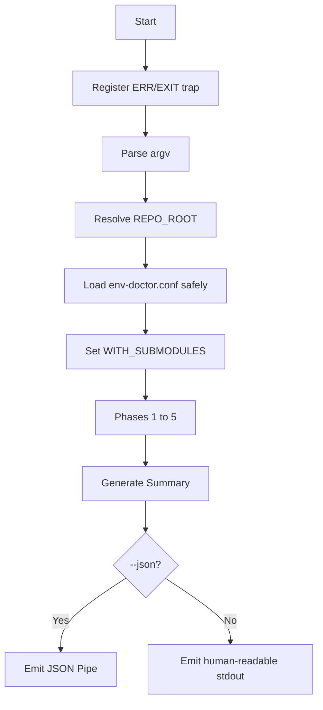

# env-doctor Architecture (GW-AAP Design)

This document describes the design and flow of `env-doctor`, structured around the **GlitchWorks Agnostic Architecture Protocol (GW-AAP)**.

## 1. Entry and Bootstrap (Dependency Injection)

1. **Argv**: Combined short flags (`-it2`) are expanded and parsed at the system boundary.
2. **`_bootstrap_env`**:
   - **`_resolve_repo_root`**: Resolves the repository root safely using git or script-relative paths.
   - **Dynamic Configuration Sourcing**: Loads `$REPO_ROOT/.env-doctor.conf` safely if present using `_load_config` (line-by-line KEY=value allowlist parser). If `--unsafe-source-config` is specified, direct sourcing is allowed after file ownership and permissions checks.
   - **`WITH_SUBMODULES`**: Toggled explicitly via `--with-submodules` (default: false).

## 2. Phases (Modular Execution)

| Phase | Role |
|-------|------|
| **1** | Shell & OS Discovery: OS name/arch, shell version, shell configs, alias-shadow heuristics. |
| **2** | Tooling Discovery: Project-type detection (`pyproject.toml`, `package.json`, `Cargo.toml`, `go.mod`); required/recommended tool checks; Python venv + optional `ENV_DOCTOR_PYTHON_DEPS` imports. |
| **3** | Git & Submodule Discovery: Branch, remote, dirty tree; submodule status loop (core vs other classification); private URL list + SSH check; orphan gitlink check vs `.gitmodules`. |
| **4** | Credentials & Config: `.env` vs `env.example`, `gh auth`, Docker daemon, Cursor MCP placeholder scan. |
| **5** | Progressive Init (`--init` only): Tiered progressive environment setup (Python venv, core submodules, all submodules, Docker compose). |

## 3. Exit Codes (Predictable Failure)

- **0**: No `_fail` rows (warnings allowed).
- **1**: One or more `_fail` rows (e.g. required tools missing, orphan gitlinks).

## 4. JSON Output (Open Piping Contract)

When run with `--json` / `-j`, the tool emits a single JSON object conforming to the `env-doctor/1` schema. To guarantee injection-proof JSON, all values are passed through `_escape_json_string` which escapes backslashes, quotes, and control characters (`\n`, `\t`, `\r`, `\b`, `\f`) and strips any other non-printable control characters (ASCII 0-31).

```json
{
  "schema": "env-doctor/1",
  "results": [
    { "type": "section", "key": "Phase 1: Shell & OS Discovery", "value": "" },
    { "type": "pass", "key": "OS", "value": "macOS 14.5 (arm64)" },
    { "type": "warn", "key": "Working tree", "value": "3+ uncommitted changes" }
  ],
  "issues": 0,
  "warnings": 1,
  "ok": true
}
```

### Record Types (`type` field)
- `section`: Header for a execution phase.
- `pass`: Check completed successfully.
- `warn`: Check passed but with non-fatal warnings.
- `fail`: Check failed and registered as an issue.
- `info`: Informational message.
- `status`: Final summary status.

## 5. Extension Points (Dynamic Configuration)

- **Core repo regex**: `ENV_DOCTOR_CORE_REPOS` (no hardcoded names in the script).
- **Python imports**: `ENV_DOCTOR_PYTHON_DEPS` (comma-separated).
- **Help URL**: `ENV_DOCTOR_HELP_URL` for private-repo credential hints.

## 6. Error Handling & Traps

An `ERR` and `EXIT` trap (`_error_trap`) is registered at startup. If the script encounters an unexpected failure (non-zero exit code), the trap intercepts it and emits a clean, typed error message (and a valid JSON envelope under `--json`) before exiting.

## 7. Execution Flow (Mermaid)


