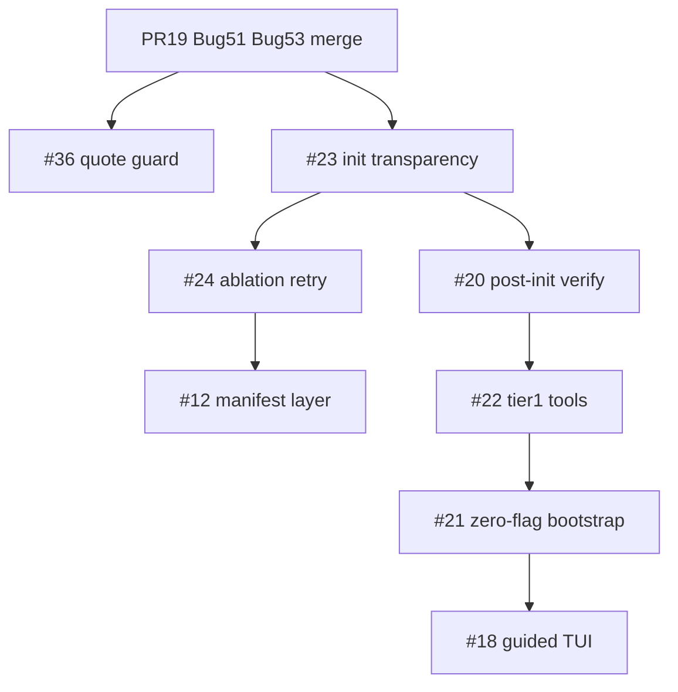

# Multi-agent orchestration — heal correctness + white-glove tier 1 rewrite

**Epic:** major init/heal rewrite after PR #19 review (Bug #51 / #53).  
**Draft umbrella PR:** branch `greyzxcursor/heal-orchestration-major-rewrite-4c79`  
**Prerequisite:** merge PR #19 (git URL false positive + `ENV_DOCTOR_REPO` injection guards).

## Goal

Transform env-doctor from **audit-with-false-green-init** into an **idiot-proof, polymorphic heal pipeline**:

1. **Honest init** — no silent `|| true` passes (#23)
2. **Post-init verify** — re-ping deps after heal (#20)
3. **Graceful ablation + retry** — predictable skip vs block + transient recovery (#24)
4. **Tier 1 tool hydration** — install gh / pre-commit / docker CLI where sensible (#22)
5. **Zero-flag bootstrap** — common-sense tier 1 without flags (#21)
6. **Guided TUI** — interactive capability matrix (#18)
7. **Manifest layer** — `lib/hydration/` host for policies (#12)

## Issue map (agent assignments)

| Stream | Issue | Priority | Agent focus | Branch suffix |
|--------|-------|----------|-------------|---------------|
| **A — Correctness** | [#23](https://github.com/k-dot-greyz/env-doctor/issues/23) | P0 | Init step transparency | `init-transparency-4c79` |
| **A — Correctness** | [#20](https://github.com/k-dot-greyz/env-doctor/issues/20) | P0 | Post-init verify loop | `post-init-verify-4c79` |
| **A — Correctness** | [#36](https://github.com/k-dot-greyz/env-doctor/issues/36) | P0 | Quote metachar denylist (Bug #54) | `repo-path-quote-guard-4c79` |
| **B — Architecture** | [#24](https://github.com/k-dot-greyz/env-doctor/issues/24) | P1 | Ablation matrix + retry loop | `ablation-retry-4c79` |
| **B — Architecture** | [#12](https://github.com/k-dot-greyz/env-doctor/issues/12) | P1 | `lib/hydration/` manifest layer | `hydration-manifest-4c79` |
| **C — UX / onboarding** | [#22](https://github.com/k-dot-greyz/env-doctor/issues/22) | P1 | Tier 1 tool hydration | `tier1-tools-4c79` |
| **C — UX / onboarding** | [#21](https://github.com/k-dot-greyz/env-doctor/issues/21) | P1 | Zero-flag smart bootstrap | `zero-flag-bootstrap-4c79` |
| **C — UX / onboarding** | [#18](https://github.com/k-dot-greyz/env-doctor/issues/18) | P2 | Guided TUI / capability matrix | `guided-tui-4c79` |
| **D — Platform** | [#8](https://github.com/k-dot-greyz/env-doctor/issues/8) | P2 | Multi-distro backends | `multi-distro-4c79` |
| **D — Platform** | [#9](https://github.com/k-dot-greyz/env-doctor/issues/9) | P2 | Modern stack tier 2 | `modern-stack-4c79` |

**Labels to apply manually** (token cannot add labels): `enhancement`, `architecture`, `plan`, `workflow`, `hydration-follow-up` (create if missing), `P0` / `P1` as appropriate.

Tag every issue body with: `hydration-follow-up` + `orchestration-epic` (search: `repo:k-dot-greyz/env-doctor orchestration-epic in:body`).

## Execution order (critical path)



### Parallel lanes (after #23 lands)

| Lane | Issues | Can run together |
|------|--------|------------------|
| Lane 1 | #20 + #24 | Yes — verify vs retry scaffold |
| Lane 2 | #12 manifest | Yes — parallel to Lane 1 |
| Lane 3 | #8 multi-distro | After #12 scaffold exists |

## Per-agent briefs

### Agent A1 — #23 Init transparency (P0)

**Problem:** `phase5_init` swallows failures with `|| true` then emits `_pass "Tier 1 init"`.

**Upgrade path:**

1. Introduce `_init_step_run name cmd...` helper capturing exit code.
2. Replace blanket `_pass` with per-step `_pass` / `_warn` / `_fail`.
3. Add `INIT_STEP_FAILURES` counter; surface in summary JSON.
4. JSON keys: `init:pip-dev`, `init:pre-commit`, `init:submodule`, etc.

**Files:** `env-doctor.sh` (`phase5_init`), `tests/init-transparency.sh` (new).

**Tests:** Mock failing pip → expect `fail` or `warn` row, not `pass` for tier init.

**Blocks:** #20, #24, #21.

---

### Agent A2 — #20 Post-init verify (P0)

**Problem:** Discovery runs before init; no second-pass probe after heal.

**Upgrade path:**

1. Add `phase5b_verify` after `phase5_init` when `DO_INIT` or `--verify-only`.
2. Re-run `_check_tool`, venv activation, `ENV_DOCTOR_PYTHON_DEPS` imports for active tier.
3. Distinct JSON section: `Phase 5b: Post-init verification`.
4. Optional flag: `--verify-only` (read-only re-probe, no mutations).

**Files:** `env-doctor.sh`, `tests/init-verify.sh` (new), `docs/README.md` (flag docs).

**Depends on:** #23.

---

### Agent A3 — #36 Quote metachar guard (P0)

**Problem:** Bugbot — `"` omitted from `ENV_DOCTOR_REPO` denylist; breaks out of double-quoted profile embed.

**Upgrade path:**

1. Centralize `_path_safe_for_profile_embed path` in `env-doctor.sh`.
2. Deny: `$ \` ; & | < > ( ) \ " newline`.
3. Use helper in `_load_config`, `_hydrate_path_persistent`, `scripts/env-config.sh`.
4. Regression test: path `/tmp/foo"; evil` rejected; no profile write.

**Files:** `env-doctor.sh`, `scripts/env-config.sh`, `tests/security.sh`.

**Note:** May land on PR #19 or first orchestration sub-PR.

---

### Agent B1 — #24 Ablation + retry (P1)

**Problem:** Ad-hoc abort/continue; no retry on transient network failures.

**Upgrade path:**

1. Define ablation matrix (blocking vs skippable per step/tier) — see issue #24.
2. `_retry_init_step max class cmd...` with `ENV_DOCTOR_INIT_MAX_RETRIES` (default 3), backoff 2/4/8s for `network` class.
3. Emit `type=info` when ablating with reason string.
4. Document matrix in `docs/STATUS.md`.

**Files:** `env-doctor.sh` or `lib/hydration/retry.sh`, `tests/ablation-retry.sh`.

**Depends on:** #23. Ideal merge target after #12 scaffold if manifest hosts policies.

---

### Agent B2 — #12 Manifest layer (P1)

**Problem:** ~1.7k-line monolith; hydration logic not data-driven.

**Upgrade path:**

1. Create `lib/hydration/manifest.json` (or YAML) — tool defs, tiers, backends.
2. Move `_tier2_install_tool`, ablation policies, retry classes into manifest-driven loader.
3. `env-doctor.sh` calls `lib/hydration/install.sh` shim.

**Files:** `lib/hydration/*`, `env-doctor.sh` (thin calls), tests.

**Enables:** #8, #9, #24.

---

### Agent C1 — #22 Tier 1 tools (P1)

**Problem:** docker/gh/pre-commit are tier 1 **recommended** but never installed.

**Upgrade path:**

1. Extend tier 1 init: `pre-commit` via venv pip; `gh`/`docker` via platform backend with `--yes`.
2. Dry-run plans visible; post-install verify (#20) confirms `--version`.

**Depends on:** #20, #23. Optional #8 for non-apt.

---

### Agent C2 — #21 Zero-flag bootstrap (P1)

**Problem:** `bash env-doctor.sh` is audit-only; requires `--init`.

**Upgrade path:**

1. After discovery, if healable tier 0/1 issues and not `CI`/`NONINTERACTIVE`: auto-run safe local tier 1 (venv, pip dev, pre-commit hooks).
2. `--json --quiet` stays read-only (agents opt in with `--init`).
3. Run post-init verify (#20).

**Depends on:** #20, #23, #22.

---

### Agent C3 — #18 Guided TUI (P2)

**Problem:** Umbrella UX issue — interactive flavor picker.

**Upgrade path:**

1. TTY + no `--json`: show capability matrix menu (Python / Node / Full / Audit-only).
2. Map choices to tier + flags; delegate to init + verify pipeline.
3. Split from #21 Phase B — headless bootstrap ships first.

**Depends on:** #21 Phase A.

## Branch convention

```
greyzxcursor/<issue#>-<short-slug>-4c79
```

Examples:

- `greyzxcursor/23-init-transparency-4c79`
- `greyzxcursor/20-post-init-verify-4c79`

Stack sub-PRs onto `greyzxcursor/heal-orchestration-major-rewrite-4c79` or merge to `main` in dependency order.

## Test gates (every sub-PR)

```bash
make ci          # shellcheck + smoke + security + ubuntu-hydration
make test        # full suite
```

New suites expected:

- `tests/init-transparency.sh`
- `tests/init-verify.sh`
- `tests/ablation-retry.sh`

**Current baseline:** 65 assertions (35 smoke + 15 security + 15 ubuntu-hydration).

## Definition of done (epic)

- [ ] No init step reports PASS when underlying command failed (#23)
- [ ] Post-init verify runs after every `--init` (#20)
- [ ] `ENV_DOCTOR_REPO` path validation includes `"` and is centralized (#36)
- [ ] Ablation + retry documented and tested (#24)
- [ ] `bash env-doctor.sh` heals tier 1 safe deps by default (#21)
- [ ] gh / pre-commit / docker CLI hydrated at tier 1 with consent (#22)
- [ ] Manifest layer extracted (#12) — or staged behind feature flag
- [ ] `docs/STATUS.md` + `QUICKSTART.md` reflect new defaults
- [ ] All CI green; assertion count increased with new suites

## Related

- [FOLLOW_UPS.md](FOLLOW_UPS.md) — issue index
- [STATUS.md](STATUS.md) — platform matrix
- PR #19 — Bug #51 / #53 security fixes
- Issue [#37](https://github.com/k-dot-greyz/env-doctor/issues/37) — orchestration epic tracker
