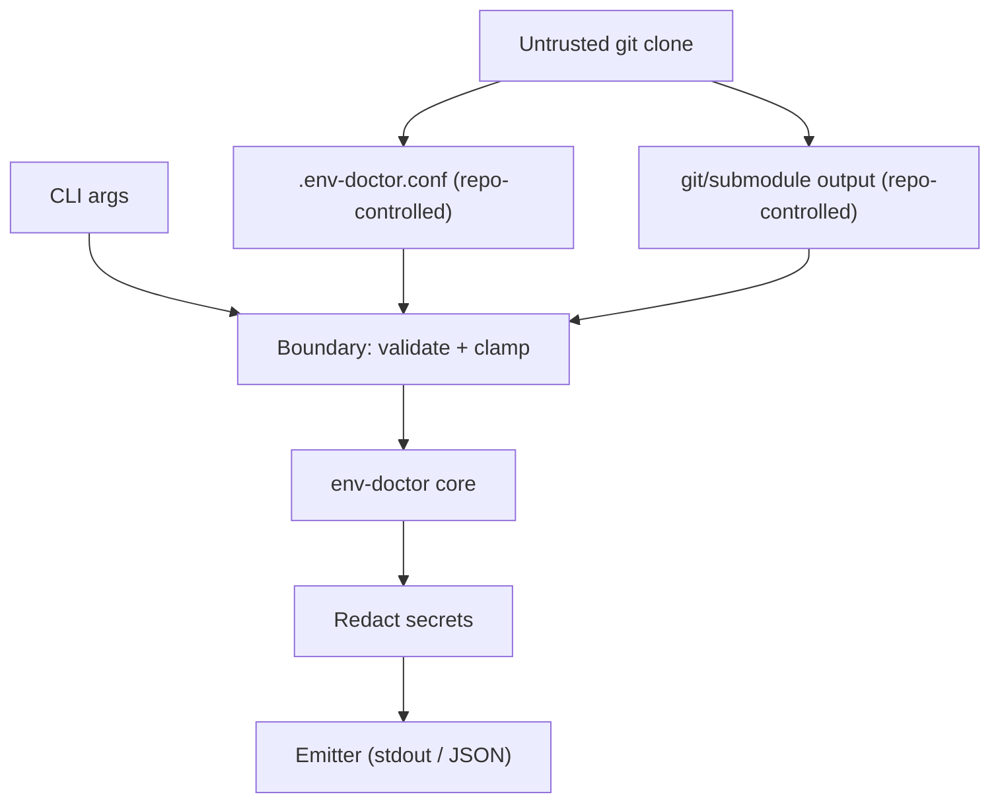

# Threat Model: env-doctor

This document outlines the security architecture, trust boundaries, threat vectors, and mitigations implemented in `env-doctor` to ensure safe operation in enterprise and untrusted repository environments.

## Security Architecture & Trust Boundaries

`env-doctor` is designed to be dropped into any repository and run. Because the repository contents (including configuration files, git remote URLs, submodule URLs, and tool version strings) are controlled by the repository itself, they must be treated as untrusted inputs.

## Threat Vectors & Mitigations

### 1. Arbitrary Code Execution (RCE) via Configuration Sourcing
* **Threat**: A malicious repository includes a `.env-doctor.conf` file containing arbitrary shell commands. If `env-doctor` sources this file directly, it executes those commands with the permissions of the running user.
* **Mitigation**: Direct sourcing (`source .env-doctor.conf`) has been replaced by a safe KEY=value allowlist parser (`_load_config`).
  * Only an allowlist of keys (`BRAND`, `ENV_DOCTOR_CORE_REPOS`, `ENV_DOCTOR_PYTHON_DEPS`, `ENV_DOCTOR_HELP_URL`) is accepted.
  * Line-by-line parsing is performed without `eval` or `source`.
  * Value lengths are capped at 1024 characters, and characters are validated against strict charsets.
* **The `--unsafe-source-config` Caveat**: For legacy or advanced setups requiring dynamic shell logic in configuration, users can opt-in using `--unsafe-source-config`. This is strictly guarded by a file permissions and ownership check:
  * Sourcing is refused if the file is world-writable.
  * Sourcing is refused if the file is not owned by the running user or `root`.

### 2. Command Injection via Tool Version Checks
* **Threat**: A malicious repository includes mock tools or binaries in the `PATH` or `.venv/bin` whose version flags output shell injection sequences. If `env-doctor` uses `eval` to check tool versions, it executes the injected commands.
* **Mitigation**: The `eval` statement has been completely eliminated from `_check_tool`. Commands are invoked directly as an argument array `"$full_cmd" "${args[@]}"`, ensuring that arguments are never interpreted as shell commands.

### 3. Secret Leakage in Outputs
* **Threat**: Git remote URLs or submodule URLs containing embedded credentials (e.g., GitHub Personal Access Tokens, GitLab tokens, or generic basic auth credentials) are printed to `stdout` or emitted in the `--json` payload, leaking secrets to CI logs or agent transcripts.
* **Mitigation**: All git and submodule URLs are passed through `_redact_git_url` before being printed or emitted.
  * Redacts GitHub `x-access-token` and `x-oauth-basic` tokens.
  * Redacts GitHub `ghp_`, `ghs_`, `gho_`, `ghr_`, and Personal Access Tokens.
  * Redacts GitLab `glpat-` tokens.
  * Redacts any generic `username:password` credentials embedded in `http://`, `https://`, `ssh://`, or `git://` URLs.

### 4. JSON Envelope Breakage
* **Threat**: A tool version string or git output containing control characters (like newlines, tabs, carriage returns, or other non-printable characters) breaks the JSON output envelope, causing downstream agents or CI parsers to fail or parse incorrect data.
* **Mitigation**: The JSON line formatter `_jline` uses a robust escaping helper `_escape_json_string` which:
  * Escapes backslashes (`\`) and double quotes (`"`).
  * Escapes common control characters (`\n`, `\t`, `\r`, `\b`, `\f`).
  * Strips any other non-printable control characters (ASCII 0-31) using a portable `tr` filter.

### 5. Unauthorized System Mutations
* **Threat**: Running `--init` on an untrusted repo triggers unauthorized system-wide package installations or executes commands with `sudo` privileges without the user's knowledge or consent.
* **Mitigation**: All Tier 2 package installations (such as `brew install` or `sudo apt-get install`) are gated behind explicit user consent.
  * Requires the `--yes` or `-y` flag, or setting `ENV_DOCTOR_ASSUME_YES=true`.
  * If consent is not provided, `env-doctor` prints the command and skips execution, never invoking `sudo` silently.

## Residual Risk

* **Compromised PATH**: If the user's local path contains a compromised binary that shares a name with a standard tool (e.g., `git`), `env-doctor` will execute it. This is a standard risk for any shell script and can be mitigated by ensuring the integrity of the system `PATH`.
* **Unsafe Sourcing Opt-in**: Sourcing a file with `--unsafe-source-config` bypasses safe parsing. Users must only use this flag in repositories they fully trust.
